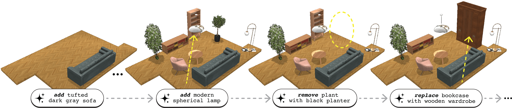
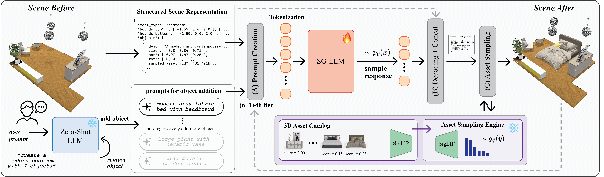

<div align="center">

# ReSpace: Text-Driven Autoregressive 3D Indoor <br/> Scene Synthesis and Editing

[**Martin JJ. Bucher**](https://mnbucher.com) · [**Iro Armeni**](http://ir0.github.io)

Stanford University

[](https://arxiv.org/abs/2506.02459)
[](https://respace.mnbucher.com)
[](https://www.youtube.com/watch?v=2IMHWJqgDPg)
[](https://huggingface.co/gradient-spaces/respace-sg-llm-1.5b)

</div>

## Abstract
Scene synthesis and editing has emerged as a promising direction in computer graphics. Current trained approaches for 3D indoor scene generation either oversimplify object semantics through one-hot class encodings (e.g., 'chair' or 'table'), require masked diffusion for editing, ignore room boundaries, or rely on floor plan renderings that fail to capture complex layouts. LLM-based methods enable richer semantics via natural language, but lack editing functionality, are limited to rectangular layouts, or rely on weak spatial reasoning from implicit world models. We introduce ReSpace, a generative framework for autoregressive text-driven 3D indoor scene synthesis and editing. Our approach features a compact structured scene representation with explicit room boundaries that enables asset-agnostic deployment and frames scene manipulation as a next-token prediction task, supporting object addition, removal, and swapping via natural language. We employ supervised fine-tuning with a preference alignment stage to train a specialized language model for object addition that accounts for user instructions, spatial geometry, object semantics, and scene-level composition. We further introduce a voxelization-based evaluation metric capturing fine-grained geometric violations beyond 3D bounding boxes. Experiments surpass state-of-the-art on object addition and achieve superior human-perceived quality on the application of full scene synthesis, despite not being trained on it.



## ✨ Key Features

- **Text-Driven Editing**: Add, remove, and swap objects via natural language instructions
- **Structured Scene Representation (SSR)**: Lightweight JSON-based format with explicit room boundaries and natural language object descriptions
- **Specialized SG-LLM**: Language model trained specifically for 3D spatial reasoning and object placement  
- **Preference Alignment**: RLVR training with reward function involving geometric and semantic constraints
- **Voxelization-Based Loss**: Fine-grained evaluation beyond 3D bounding boxes

## Comparison With Recent Methods

| Method | Non-Rectangular Layouts | Explicit Object Semantics | Text-Driven Editing | Trained Placement | Asset Sampling |
|--------|:----------------------:|:-------------------------:|:-------------------:|:-----------------:|:--------------:|
| ATISS | ✅ | ❌ | ❌ | ✅ | ❌ |
| Mi-Diff | ✅ | ❌ | ❌ | ✅ | ❌ |
| LayoutGPT | ❌ | ✅ | ❌ | ❌ | ❌ |
| LayoutVLM | ❌ | ✅ | ❌ | ❌ | ❌ |
| InstructScene | ❌ | ❌ | ❌ | ✅ | ❌ |
| Ctrl-Room | ✅ | ❌ | ❌ | ✅ | ❌ |
| SceneWeaver | ❌ | ✅ | ❌ | ✅ | ❌ |
| **ReSpace (ours)** | ✅ | ✅ | ✅ | ✅ | ✅ |

## ReSpace: Framework Overview

<div align="center">

</div>

We introduce a novel text-driven framework for autoregressive 3D indoor scene synthesis, completion, and editing—supporting object addition, removal, and swapping via natural language prompts. More details can be found on the project website and the paper.

## 📦 Installation

First, clone this repo to get the source code and install the necessary pip packages. The commands below are tested on a system with Python 3.9 and CUDA 12.2. You might need to adapt the package dependencies for your own environment.

```bash
# clone the repository
git clone https://github.com/GradientSpaces/respace.git
cd respace

# create conda environment
conda create -n respace python=3.9 -y
conda activate respace

# install dependencies
pip install -r requirements.txt --extra-index-url https://download.pytorch.org/whl/cu121
conda install cudnn=9 -c conda-forge -y
conda install nccl -c conda-forge -y
```
Next, you will need to download the 3D-FUTURE asset catalog from Alibaba <a href="https://tianchi.aliyun.com/dataset/98063">here</a>. You will need to click on the orange "Apply for dataset" button, create an account, and await approval before you can download the .zip files that contain the 3D assets from the catalog. You will need these meshes for the sampling engine later. After you have a single root folder that contains all asset folders, you need to provide the path to this folder in the ```.env``` file via ```PTH_3DFUTURE_ASSETS=...```. You will need to do the same for the 3D-FRONT dataset <a href="https://tianchi.aliyun.com/dataset/65347">here</a> and provide the path in the same ```.env``` file via ```PTH_3DFRONT_SCENES=...```.

After providing the paths for the two folders, you will need to run our preprocessing script to obtain scaled assets from the original 3D-FUTURE. Our method does not work directly with scaling properties as part of the SSR and assumes scaled assets as input/output, resembling more real-world use-cases where we can't scale assets arbitrarily. For this, you need to make sure the path under ```PTH_3DFUTURE_ASSETS``` is set, then convert all assets into GLB format and scale them:

```bash
python ./src/preprocessing/3d-front/01_convert_assets_obj_glb.py
python ./src/preprocessing/3d-front/scale_assets.py
```

Finally, we need to pre-compute and cache the embeddings and size properties for the asset calog so the sampling engine can work with this cache. You can use an existing version of this cache, assuming no modification to the asset catalog has been taken. The file is available here: <a href="https://drive.google.com/file/d/1T-4cwzNrR2MAAPyxsHrcNhNHh4HXc4vY">https://drive.google.com/file/d/1T-4cwzNrR2MAAPyxsHrcNhNHh4HXc4vY</a>. Make sure the file is located under ```./data/metadata/model_info_3dfuture_assets_embeds.pickle``` and is ~174MB. If you want to run the cache compilation from scratch, you can run:

```bash
python ./src/preprocessing/3d-front/06_compute_embeds.py
```

## 🚀 Quick Start

### 1. Init ReSpace Module
```python
from src.respace import ReSpace
from pathlib import Path
import json

# init respace module
# if you run this command for the first time, it will download model checkpoints for respace-sg-llm-1.5b and llama-3.1-8b via huggingface
# those will be cached and loading this module for subsequent runs will be much faster
respace = ReSpace()

# load existing scene in SSR via JSON as python dictionary
scene = json.loads('{"room_type": "bedroom", "bounds_top": [[- ...')

# for the rendering examples below, we assume that every object has a corresponding asset via sampled_jid
# if not, you can use the sampling engine for asset selection (see section 5 below)

# create rendering (single frame)
# will create renderings with name '<filename>.jpg' inside pth_viz_output
# diagonal perspective in 'diag' folder and top-down in 'top' folder
# requires sampled assets in order to visualize mesh (see asset sampling engine below on how to sample/resample assets)
respace.render_scene_frame(scene, filename="frame", pth_viz_output=Path("./eval/viz/misc/test-june"))

# create rendering (360° rotating video)
respace.render_scene_360video(scene, filename="video-360", pth_viz_output="./eval/viz/misc/test-june")
```

### 2. Object Addition
```python
scene = ...

updated_scene, is_success = respace.handle_prompt("add modern wooden wardrobe", scene)

# you can also use add_object if you want to skip command decomposition via zero-shot LLM (and directly go via SG-LLM)
updated_scene, is_success = respace.add_object("add modern wooden wardrobe", scene)
```

### 3. Full Scene Generation
```python
# full scene generation (unconditional; no floor plan provided)
new_scene, is_success = respace.handle_prompt("create bedroom with 8 objects")
```

### 4. Scene Editing
```python
scene = ...

# remove objects via handle_prompt
edited_scene, is_success = respace.handle_prompt("remove old wooden chair", scene)

# or directly via removal command
edited_scene, is_success = respace.remove_object("old wooden chair", scene)

# swap objects via one single text command
edited_scene, is_success = respace.handle_prompt("swap black couch with modern bookshelf", scene)
```

### 5. Asset Sampling
```python
scene = ...

# resample asset of very last object (greedy sampling)
scene_alt = respace.resample_last_asset(scene, is_greedy_sampling=True)

# resample asset of very last object (true stochastic sampling)
scene_alt = respace.resample_last_asset(scene, is_greedy_sampling=False)

# resample all objects
scene_alt = respace.resample_all_assets(scene, is_greedy_sampling=True)
```

## 🗂️ Dataset

We introduce **SSR-3DFRONT**, a processed version of 3D-FRONT with:
- 13,055 valid indoor scenes
- Explicit room boundaries as rectilinear polygons  
- Natural language object descriptions via GPT-4o
- Comprehensive prompt banks (10 prompts per object)

Checkout the dataset here: <a href="https://huggingface.co/datasets/gradient-spaces/SSR-3DFRONT">https://huggingface.co/datasets/gradient-spaces/SSR-3DFRONT</a>

Download the raw dataset via:
```bash
python src/scripts/download_ssr3dfront_dataset.py
```

where the dataset will be located under ```./dataset-ssr3dfront/```

Or get it in the Huggingface Dataset format:
```python
# load dataset
dataset = load_dataset("gradient-spaces/SSR-3DFRONT")

# access all samples from train (all 3 splits)
train_data = dataset["train"]

# get only train samples from bedroom dataset
bedroom_train = train_data.filter(lambda x: "bedroom_train" in x["splits"])

# get only val samples from all split
all_val = val_data.filter(lambda x: "all_val" in x["splits"])

# get props of sample
sample = all_val[0]
print(f"Room type: {sample['room_type']}")
print(f"Number of objects: {sample['n_objects']}")
print(f"Scene: {sample['scene']}")
```

## 🏋️ Training

Before starting training, you might need to ask for permission for the model checkpoints and set your HF token via ```HF_TOKEN``` env variable.

### Stage 1: Supervised Fine-Tuning (SFT)
```bash
./src/scripts/train/respace_train_stage_1_sft.sh
```

### Stage 2: Preference Alignment (RLVR with RFT)
```bash
./src/scripts/train/respace_train_stage_2_rft.sh
```

## 📈 Evaluation

You will need to set the correct model checkpoints under the MODEL_ID env variable for the evals (if you trained your own SG-LLM). You can also use our existing weights (released via <a href="https://huggingface.co/gradient-spaces/respace-sg-llm-1.5b">https://huggingface.co/gradient-spaces/respace-sg-llm-1.5b</a>; they get automatically pulled if you don't modify the ReSpace module path inside ```respace.py```).

If you want to use our method as a baseline or build up on it, you can run the evaluation scripts below. Please note that by default the full evaluation on all three datasetes is enabled. It will be better to uncomment the sections that you don't want to run for better controllability, e.g. first only evaluate on bedrooms etc.

If you did not modify the datasets (and want to compare to our method as-is with the same room types), before you run the evalution scripts, you need to download a ZIP file that contains renderings from the ground-truth dataset for each room type split. The file is available here: <a href="https://drive.google.com/file/d/1UB42LsE715McfDqsLDgtxHKCAUiPIGrn">https://drive.google.com/file/d/1UB42LsE715McfDqsLDgtxHKCAUiPIGrn</a>.

Make sure you unzip the file, rename the folder to "viz" and locate the folder under ```./eval/viz``` such that the subfolders are like ```./eval/viz/3d-front-train-full-scenes-all```.

Now, look into the evaluation shell scripts below and uncomment the room types that you don't want to run. Additionally, you can modify the BON_LLM parameter for Best-of-N sampling (and other params for the full scenes).

If you want to use the default weights via HF for SG-LLM (and not your custom trained one), then drop the CLI flag in the shell script, i.e. remove ```--model-id=$MODEL_ID``` completely from the line where ```pipeline.py``` is listed. This will trigger the pipeline to take the model from HF instead of a local one.

### Single Object Addition
The following bash script contains all evaluation scripts for addition and removal. Check out the script and uncomment the ones you do not want to run.
```bash
./src/scripts/eval/respace_eval_instr.sh
```

### Full Scene Synthesis
The following bash script contains all evaluation scripts for full scene synthesis. Check out the script and uncomment the ones you do not want to run.
```bash
./src/scripts/eval/respace_eval_full.sh
```

## ✉️ Contact

If you have any questions regarding this project, please contact Martin (mnbucher@stanford.edu). You can also open an issue if you have trouble setting up the code base.

## 🙏 Acknowledgments

- [3D-FRONT](https://tianchi.aliyun.com/specials/promotion/alibaba-3d-scene-dataset) for the base dataset
- [3D-FUTURE](https://tianchi.aliyun.com/specials/promotion/alibaba-3d-future-dataset) for 3D assets
- [Huggingface](https://github.com/huggingface) for SFT and GRPO implementations
- [Qwen2.5](https://huggingface.co/Qwen/Qwen2.5-1.5B-Instruct) for the instruction-tuned LLMs for our SG-LLM
- [LLama3.1](https://huggingface.co/meta-llama/Llama-3.1-8B-Instruct) for the instruction-tuned models for our zero-shot LLM

## 🎓 Citation

If using our dataset/model or if you found our work useful, please consider citing us as follows:

```bibtex
@article{bucher2025respace,
  title={ReSpace: Text-Driven 3D Scene Synthesis and Editing with Preference Alignment},
  author={Bucher, Martin JJ and Armeni, Iro},
  journal={arXiv preprint arXiv:2506.02459},
  year={2025}
}
```
